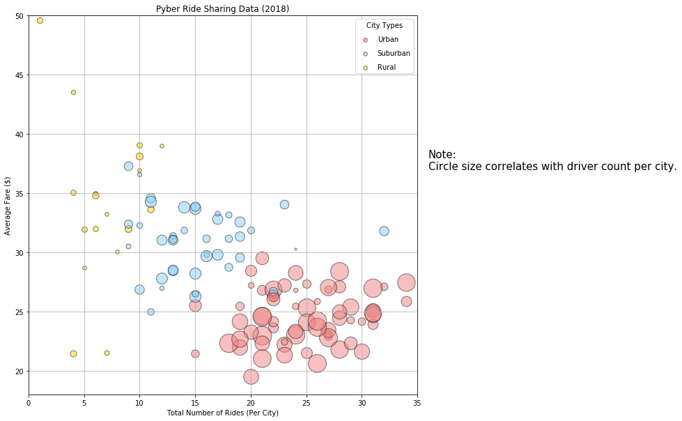

# Pyber Ride Sharing

## Analysis
#### Observed Trend 1: There is a trendancy I observed from the bubble chart, that is, the more rides the less average fares.
#### Observed Trend 2: The rides in urban cities (~68%) are much more than the rides in suburban (~26%) and rural (~5%) cities.
#### Observed Trend 3: Urban cities have the largest percentage of drivers (~78%) which is over the sum of suburban and rural.


```python
import pandas as pd
import matplotlib.pyplot as plt
import seaborn as sns
```


```python
origin_city_data = pd.read_csv("raw_data/city_data.csv")
ride_data = pd.read_csv("raw_data/ride_data.csv")
```


```python
origin_city_data.head()
# set city as index
# city_data_as_index = origin_city_data.set_index('city')
```


<div>
<style scoped>
    .dataframe tbody tr th:only-of-type {
        vertical-align: middle;
    }

    .dataframe tbody tr th {
        vertical-align: top;
    }

    .dataframe thead th {
        text-align: right;
    }
</style>
<table border="1" class="dataframe">
  <thead>
    <tr style="text-align: right;">
      <th></th>
      <th>city</th>
      <th>driver_count</th>
      <th>type</th>
    </tr>
  </thead>
  <tbody>
    <tr>
      <th>0</th>
      <td>Kelseyland</td>
      <td>63</td>
      <td>Urban</td>
    </tr>
    <tr>
      <th>1</th>
      <td>Nguyenbury</td>
      <td>8</td>
      <td>Urban</td>
    </tr>
    <tr>
      <th>2</th>
      <td>East Douglas</td>
      <td>12</td>
      <td>Urban</td>
    </tr>
    <tr>
      <th>3</th>
      <td>West Dawnfurt</td>
      <td>34</td>
      <td>Urban</td>
    </tr>
    <tr>
      <th>4</th>
      <td>Rodriguezburgh</td>
      <td>52</td>
      <td>Urban</td>
    </tr>
  </tbody>
</table>
</div>


```python
# group by city
groupby_city = origin_city_data.groupby('city')
# sum up the driver count by city (If there is a duplicate city, the driver count would be added up.)
city_data = groupby_city.sum()
# drop the duplicate city, Port James, from the original dataset
dropped_duplicates_mask = origin_city_data['city'].duplicated(keep='first')
dropped_duplicates_df = origin_city_data[~dropped_duplicates_mask]
dx = dropped_duplicates_df.set_index('city')
# add `city type` to the dataframe `city_data`
city_data['type'] = dx['type']
# reset the index
new_city_data = city_data.reset_index()
new_city_data_city_as_index = new_city_data.set_index('city')
origin_city_data
```


<div>
<style scoped>
    .dataframe tbody tr th:only-of-type {
        vertical-align: middle;
    }

    .dataframe tbody tr th {
        vertical-align: top;
    }

    .dataframe thead th {
        text-align: right;
    }
</style>
<table border="1" class="dataframe">
  <thead>
    <tr style="text-align: right;">
      <th></th>
      <th>city</th>
      <th>driver_count</th>
      <th>type</th>
    </tr>
  </thead>
  <tbody>
    <tr>
      <th>0</th>
      <td>Kelseyland</td>
      <td>63</td>
      <td>Urban</td>
    </tr>
    <tr>
      <th>1</th>
      <td>Nguyenbury</td>
      <td>8</td>
      <td>Urban</td>
    </tr>
    <tr>
      <th>2</th>
      <td>East Douglas</td>
      <td>12</td>
      <td>Urban</td>
    </tr>
    <tr>
      <th>3</th>
      <td>West Dawnfurt</td>
      <td>34</td>
      <td>Urban</td>
    </tr>
    <tr>
      <th>4</th>
      <td>Rodriguezburgh</td>
      <td>52</td>
      <td>Urban</td>
    </tr>
    <tr>
      <th>5</th>
      <td>South Josephville</td>
      <td>4</td>
      <td>Urban</td>
    </tr>
    <tr>
      <th>6</th>
      <td>West Sydneyhaven</td>
      <td>70</td>
      <td>Urban</td>
    </tr>
    <tr>
      <th>7</th>
      <td>Travisville</td>
      <td>37</td>
      <td>Urban</td>
    </tr>
    <tr>
      <th>8</th>
      <td>Torresshire</td>
      <td>70</td>
      <td>Urban</td>
    </tr>
    <tr>
      <th>9</th>
      <td>Lisaville</td>
      <td>66</td>
      <td>Urban</td>
    </tr>
    <tr>
      <th>10</th>
      <td>Mooreview</td>
      <td>34</td>
      <td>Urban</td>
    </tr>
    <tr>
      <th>11</th>
      <td>Smithhaven</td>
      <td>67</td>
      <td>Urban</td>
    </tr>
    <tr>
      <th>12</th>
      <td>Carrollfort</td>
      <td>55</td>
      <td>Urban</td>
    </tr>
    <tr>
      <th>13</th>
      <td>Port Josephfurt</td>
      <td>28</td>
      <td>Urban</td>
    </tr>
    <tr>
      <th>14</th>
      <td>Lake Jeffreyland</td>
      <td>15</td>
      <td>Urban</td>
    </tr>
    <tr>
      <th>15</th>
      <td>South Louis</td>
      <td>12</td>
      <td>Urban</td>
    </tr>
    <tr>
      <th>16</th>
      <td>West Peter</td>
      <td>61</td>
      <td>Urban</td>
    </tr>
    <tr>
      <th>17</th>
      <td>Kimberlychester</td>
      <td>13</td>
      <td>Urban</td>
    </tr>
    <tr>
      <th>18</th>
      <td>Alyssaberg</td>
      <td>67</td>
      <td>Urban</td>
    </tr>
    <tr>
      <th>19</th>
      <td>Sarabury</td>
      <td>46</td>
      <td>Urban</td>
    </tr>
    <tr>
      <th>20</th>
      <td>Yolandafurt</td>
      <td>7</td>
      <td>Urban</td>
    </tr>
    <tr>
      <th>21</th>
      <td>Edwardsbury</td>
      <td>11</td>
      <td>Urban</td>
    </tr>
    <tr>
      <th>22</th>
      <td>New Andreamouth</td>
      <td>42</td>
      <td>Urban</td>
    </tr>
    <tr>
      <th>23</th>
      <td>New David</td>
      <td>31</td>
      <td>Urban</td>
    </tr>
    <tr>
      <th>24</th>
      <td>Arnoldview</td>
      <td>41</td>
      <td>Urban</td>
    </tr>
    <tr>
      <th>25</th>
      <td>Williamshire</td>
      <td>70</td>
      <td>Urban</td>
    </tr>
    <tr>
      <th>26</th>
      <td>Lisatown</td>
      <td>47</td>
      <td>Urban</td>
    </tr>
    <tr>
      <th>27</th>
      <td>New Aaron</td>
      <td>60</td>
      <td>Urban</td>
    </tr>
    <tr>
      <th>28</th>
      <td>Swansonbury</td>
      <td>64</td>
      <td>Urban</td>
    </tr>
    <tr>
      <th>29</th>
      <td>Fosterside</td>
      <td>69</td>
      <td>Urban</td>
    </tr>
    <tr>
      <th>...</th>
      <td>...</td>
      <td>...</td>
      <td>...</td>
    </tr>
    <tr>
      <th>96</th>
      <td>New Lynn</td>
      <td>20</td>
      <td>Suburban</td>
    </tr>
    <tr>
      <th>97</th>
      <td>Port Jose</td>
      <td>11</td>
      <td>Suburban</td>
    </tr>
    <tr>
      <th>98</th>
      <td>Johnland</td>
      <td>13</td>
      <td>Suburban</td>
    </tr>
    <tr>
      <th>99</th>
      <td>West Tony</td>
      <td>17</td>
      <td>Suburban</td>
    </tr>
    <tr>
      <th>100</th>
      <td>Port James</td>
      <td>3</td>
      <td>Suburban</td>
    </tr>
    <tr>
      <th>101</th>
      <td>Campbellport</td>
      <td>26</td>
      <td>Suburban</td>
    </tr>
    <tr>
      <th>102</th>
      <td>Port Guytown</td>
      <td>26</td>
      <td>Suburban</td>
    </tr>
    <tr>
      <th>103</th>
      <td>Webstertown</td>
      <td>26</td>
      <td>Suburban</td>
    </tr>
    <tr>
      <th>104</th>
      <td>Clarkstad</td>
      <td>21</td>
      <td>Suburban</td>
    </tr>
    <tr>
      <th>105</th>
      <td>North Tracyfort</td>
      <td>18</td>
      <td>Suburban</td>
    </tr>
    <tr>
      <th>106</th>
      <td>Martinmouth</td>
      <td>5</td>
      <td>Suburban</td>
    </tr>
    <tr>
      <th>107</th>
      <td>New Jessicamouth</td>
      <td>22</td>
      <td>Suburban</td>
    </tr>
    <tr>
      <th>108</th>
      <td>South Elizabethmouth</td>
      <td>3</td>
      <td>Rural</td>
    </tr>
    <tr>
      <th>109</th>
      <td>East Troybury</td>
      <td>3</td>
      <td>Rural</td>
    </tr>
    <tr>
      <th>110</th>
      <td>Kinghaven</td>
      <td>3</td>
      <td>Rural</td>
    </tr>
    <tr>
      <th>111</th>
      <td>New Johnbury</td>
      <td>6</td>
      <td>Rural</td>
    </tr>
    <tr>
      <th>112</th>
      <td>Erikport</td>
      <td>3</td>
      <td>Rural</td>
    </tr>
    <tr>
      <th>113</th>
      <td>Jacksonfort</td>
      <td>6</td>
      <td>Rural</td>
    </tr>
    <tr>
      <th>114</th>
      <td>Shelbyhaven</td>
      <td>9</td>
      <td>Rural</td>
    </tr>
    <tr>
      <th>115</th>
      <td>Matthewside</td>
      <td>4</td>
      <td>Rural</td>
    </tr>
    <tr>
      <th>116</th>
      <td>Kennethburgh</td>
      <td>3</td>
      <td>Rural</td>
    </tr>
    <tr>
      <th>117</th>
      <td>South Joseph</td>
      <td>3</td>
      <td>Rural</td>
    </tr>
    <tr>
      <th>118</th>
      <td>Manuelchester</td>
      <td>7</td>
      <td>Rural</td>
    </tr>
    <tr>
      <th>119</th>
      <td>Stevensport</td>
      <td>6</td>
      <td>Rural</td>
    </tr>
    <tr>
      <th>120</th>
      <td>North Whitney</td>
      <td>10</td>
      <td>Rural</td>
    </tr>
    <tr>
      <th>121</th>
      <td>East Stephen</td>
      <td>6</td>
      <td>Rural</td>
    </tr>
    <tr>
      <th>122</th>
      <td>East Leslie</td>
      <td>9</td>
      <td>Rural</td>
    </tr>
    <tr>
      <th>123</th>
      <td>Hernandezshire</td>
      <td>10</td>
      <td>Rural</td>
    </tr>
    <tr>
      <th>124</th>
      <td>Horneland</td>
      <td>8</td>
      <td>Rural</td>
    </tr>
    <tr>
      <th>125</th>
      <td>West Kevintown</td>
      <td>5</td>
      <td>Rural</td>
    </tr>
  </tbody>
</table>
<p>126 rows × 3 columns</p>
</div>


```python
# Merge the two datasets by city
merged_df = ride_data.merge(new_city_data, on='city', how='outer')
merged_df.head()
merged_df.to_csv('merged.csv')
```


```python
group_by_city = merged_df.groupby('city')

# average fare/city
average_fare=group_by_city['fare'].mean()

# total rides/city
total_rides_per_city = group_by_city['ride_id'].count()

# total drivers/city
total_drivers_per_city = new_city_data_city_as_index['driver_count']

# city types
city_types = new_city_data_city_as_index['type']

# pyber_analysis
pyber_analysis_df = pd.DataFrame()
pyber_analysis_df['Total Number of Drivers Per City'] = total_drivers_per_city
pyber_analysis_df['Average Fare']= average_fare
pyber_analysis_df['Total Number of Rides Per City'] = total_rides_per_city
pyber_analysis_df['City Types'] = city_types

# display
pyber_analysis_df.head()
```


<div>
<style scoped>
    .dataframe tbody tr th:only-of-type {
        vertical-align: middle;
    }

    .dataframe tbody tr th {
        vertical-align: top;
    }

    .dataframe thead th {
        text-align: right;
    }
</style>
<table border="1" class="dataframe">
  <thead>
    <tr style="text-align: right;">
      <th></th>
      <th>Total Number of Drivers Per City</th>
      <th>Average Fare</th>
      <th>Total Number of Rides Per City</th>
      <th>City Types</th>
    </tr>
    <tr>
      <th>city</th>
      <th></th>
      <th></th>
      <th></th>
      <th></th>
    </tr>
  </thead>
  <tbody>
    <tr>
      <th>Alvarezhaven</th>
      <td>21</td>
      <td>23.928710</td>
      <td>31</td>
      <td>Urban</td>
    </tr>
    <tr>
      <th>Alyssaberg</th>
      <td>67</td>
      <td>20.609615</td>
      <td>26</td>
      <td>Urban</td>
    </tr>
    <tr>
      <th>Anitamouth</th>
      <td>16</td>
      <td>37.315556</td>
      <td>9</td>
      <td>Suburban</td>
    </tr>
    <tr>
      <th>Antoniomouth</th>
      <td>21</td>
      <td>23.625000</td>
      <td>22</td>
      <td>Urban</td>
    </tr>
    <tr>
      <th>Aprilchester</th>
      <td>49</td>
      <td>21.981579</td>
      <td>19</td>
      <td>Urban</td>
    </tr>
  </tbody>
</table>
</div>


## Bubble Plot of Ride Sharing Data

### Approach #1 - by matplotlib


```python
# colors by city type
# Gold, Light Sky Blue, and Light Coral
colors = {'Urban':'lightcoral',
          'Suburban':'lightskyblue',
          'Rural':'gold'}

plt.figure(figsize=(10,10))

plt.xlim(0, 35)
plt.ylim(18, 50)
plt.xlabel("Total Number of Rides (Per City)",fontsize=15)
plt.ylabel("Average Fare ($)",fontsize=15)
plt.title("Pyber Ride Sharing Data (2018)",fontsize=15)


for i, r in pyber_analysis_df.iterrows():
    plt.scatter(x=r['Total Number of Rides Per City'], 
                y=r['Average Fare'], 
                s=r['Total Number of Drivers Per City']*10,
                facecolors=colors.get(r['City Types']),
                edgecolors='black',
                alpha=0.5,
                linewidths= 1
                )
    
# Here we create a legend by ploting empty lists with the desired size and label
for city_type, color in colors.items():
    plt.scatter([],[], c=color, edgecolors='black', alpha=0.5, s=30, linewidths=1,label=city_type) 
plt.legend(scatterpoints=1, labelspacing=1, title='City Types')  
# grid
plt.grid(True)
# add a side note
plt.text(36,37, s="Note:\nCircle size correlates with driver count per city.",fontsize=15)
plt.show()
```





### Approach #2- by pandas plot


```python
color = lambda city_type: colors.get(city_type)

# add a new column, `color`, to the dataframe 
pyber_analysis_df_added_color = pyber_analysis_df.copy()
pyber_analysis_df_added_color['Color'] = pyber_analysis_df['City Types'].apply(color)

# plot the bubble chart
bubble_plot = pyber_analysis_df_added_color.plot.scatter(x='Total Number of Rides Per City',
                                             y='Average Fare',
                                             c=pyber_analysis_df_added_color['Color'],
                                             s=pyber_analysis_df_added_color['Total Number of Drivers Per City']*10,
                                             alpha=.5,
                                             edgecolors='black',
                                             linewidths=1.2,
                                             figsize=(10,10))
bubble_plot.set_xlim(0, 38)
bubble_plot.set_ylim(18, 52)
bubble_plot.set_title("Pyber Ride Sharing Data (2018)",fontsize=15)
bubble_plot.set_xlabel("Total Number of Rides (Per City)", fontsize=15)
bubble_plot.set_ylabel("Average Fare ($)",fontsize=15)
bubble_plot.grid(True)

# text
bubble_plot.text(40,37, s="Note:\nCircle size correlates with driver count per city.",fontsize=15)

# Here we create a legend by ploting empty lists with the desired size and label
for city_type, color in colors.items():
    plt.scatter([],[], c=color, edgecolors='black', alpha=0.5, s=30, linewidths=1,label=city_type) 
plt.legend(scatterpoints=1, labelspacing=1, title='City Types', fontsize=10)  
plt.show()
```


### Approach #3 - by Seaborn


```python
# fig, ax = plt.subplots(figsize=(20,20))
# ax = subplot(111)
sns.set_style("darkgrid")

g = sns.lmplot(x='Total Number of Rides Per City',
               y='Average Fare',
               data=pyber_analysis_df,
               scatter_kws={'s': pyber_analysis_df['Total Number of Drivers Per City']*5,
                            'edgecolors':'black',
                            'linewidths':1.2,
                            'alpha': 0.7},             
               hue='City Types',
               palette=colors,
               fit_reg=False,
               size=10,
               aspect=1,
               legend_out=False)

# set xlim and ylim
g.ax.set_xlim(0,38)
g.ax.set_ylim(18,51)
# title, labels
g.ax.set_title("Pyber Ride Sharing Data (2018)", fontsize=15)
g.ax.set_xlabel("Total Number of Rides (Per City)", fontsize=15)
g.ax.set_ylabel("Average Fare ($)",fontsize=15)
g.ax.text(40,37, "Note:\nCircle size correlates with driver count per city.",fontsize=15)
plt.show()
```


## Total Fares by City Type


```python
group_by_city_type = merged_df.groupby('type')
# % of the total fare by city type
total_fare_by_city = group_by_city_type['fare'].sum()
total_fare = total_fare_by_city.sum()
total_fare_percent_by_city = total_fare_by_city/total_fare * 100.0
# plot the pie chart for the percent of total fares by city type 
pie_city_types = total_fare_percent_by_city.index
pie_percents = total_fare_percent_by_city.values
colors_list = [colors.get(city_type) for city_type in pie_city_types]
explode = (0,0,0.1)
plt.pie(pie_percents, explode=explode, labels=pie_city_types, colors=colors_list, autopct="%1.1f%%", 
        shadow=True, startangle=150)
plt.title("% of Total Fares by City Type")
plt.show()
```


## Total Rides by City Type


```python
# % of Total Rides by City Type
total_rides_by_city = group_by_city_type.count()['ride_id']
total_rides = total_rides_by_city.sum()
total_ride_percents_by_city = total_rides_by_city / total_rides * 100.0

# plot the chart for the percent of total rides by city type
# plot the pie chart 
pie_city_types = total_ride_percents_by_city.index
pie_percents = total_ride_percents_by_city.values
colors_list = [colors.get(city_type) for city_type in pie_city_types]
explode = (0,0,0.1)
plt.pie(pie_percents, explode=explode, labels=pie_city_types, colors=colors_list, autopct="%1.1f%%", 
        shadow=True, startangle=150)
plt.title("% of Total Rides by City Type")
plt.show()
```


## Total Drivers by City Type


```python
# % of Total Drivers by City Type

pyber_analysis_reset_pd = pyber_analysis_df.reset_index()
group_by_city_type = pyber_analysis_reset_pd.groupby('City Types')
total_drivers_by_city = group_by_city_type.sum()['Total Number of Drivers Per City']

total_drivers = total_drivers_by_city.sum()

total_driver_percents_by_city = total_drivers_by_city/total_drivers * 100.0

# plot the pie chart for the percent of total drivers by city type
pie_city_types = total_driver_percents_by_city.index
pie_percents = total_driver_percents_by_city.values
colors_list = [colors.get(city_type) for city_type in pie_city_types]
explode = (0,0,0.1)
plt.pie(pie_percents, explode=explode, labels=pie_city_types, colors=colors_list, autopct="%1.1f%%", 
        shadow=True, startangle=150)
plt.title("% of Total Driver by City Type")
plt.show()
```


